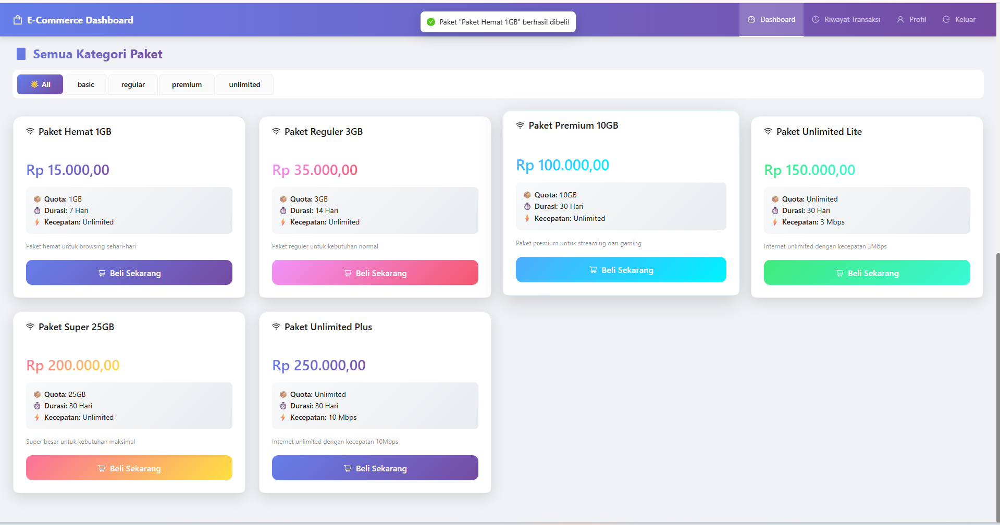

# 🧑‍🎓 Pengembang

Nama: Siska Nuri Aprilia
Program Studi: D4 Sistem Informasi Bisnis
Institusi: Politeknik Negeri Malang

---

# 🌐 Internet Package Dashboard

Aplikasi **dashboard web interaktif** berbasis **React.js** dan **Ant Design (AntD)** yang digunakan untuk mengelola data pelanggan, daftar paket internet, serta riwayat transaksi secara efisien dan modern.  
Sistem ini memiliki dua peran pengguna, yaitu **Customer** dan **Admin**, masing-masing dengan tampilan dan fitur yang berbeda.

---

## 🚀 Fitur Utama

### 🔑 Fitur Login
- Sistem login untuk membedakan antara **Admin** dan **Customer**.  
- Setiap pengguna harus masuk menggunakan akun yang valid.  
- Setelah login, pengguna diarahkan ke dashboard sesuai dengan perannya.

---

### 👥 Customer
Customer memiliki akses untuk melihat dan mengelola informasi pribadi serta riwayat transaksi.

**Menu yang tersedia:**
- 🏠 **Dashboard** – Melihat daftar semua paket internet yang tersedia.  
- 🧾 **Riwayat Transaksi** – Melihat detail pembelian paket sebelumnya.  
- 👤 **Profil** – Melihat dan mengubah informasi akun pribadi.  
- 🚪 **Logout** – Keluar dari sistem.

---

### 🧑‍💼 Admin
Admin memiliki akses penuh untuk mengelola data pelanggan, paket, dan transaksi.

**Menu yang tersedia:**
- 📊 **Dashboard** – Menampilkan statistik pelanggan, total paket, dan transaksi terbaru.  
- 👥 **Daftar Pelanggan** – Melihat dan mengelola data pelanggan.  
- 📦 **Daftar Paket** – Menambahkan, mengedit, atau menghapus data paket internet.  
- 🧾 **Riwayat Transaksi** – Melihat semua transaksi pelanggan.  
- 🚪 **Logout** – Keluar dari sistem.

---

## 🛠️ Teknologi yang Digunakan

| Kategori | Teknologi |
|-----------|------------|
| Framework Frontend | React.js |
| Library UI | Ant Design (antd) |
| Ikon | @ant-design/icons |
| Grafik | Recharts |
| State Management | React Hooks (useState, useEffect) |
| Routing | React Router DOM |
| Penyimpanan Data | Local Storage / JSON Server (opsional) |

---

# Dokumentasi Fitur Aplikasi 

| Halaman | Screenshot | Deskripsi Fitur |
|---------|------------|----------------|
| **Login Page** |  | Halaman Login Page ini berfungsi sebagai pintu masuk ke dashboard aplikasi untuk pengguna dengan berbagai peran, termasuk **admin** dan **customer**. Halaman ini menampilkan **formulir login interaktif** yang meminta username dan password, dilengkapi validasi input agar tidak kosong. Pengguna dapat masuk ke dashboard sesuai peran masing-masing: admin diarahkan ke dashboard utama, sedangkan customer diarahkan ke dashboard pelanggan. |
| **Dashboard Customer** |               | Halaman Dashboard customer ini menampilkan berbagai informasi penting, seperti **total pembelian**, **level membership**, dan daftar **paket internet** yang tersedia. Selain itu, halaman ini dilengkapi dengan fitur interaktif berupa **modal pembelian paket**, di mana pengguna dapat memilih paket internet, mengonfirmasi pembelian, serta menentukan metode pembayaran yang diinginkan. |
| **Riwayat Transaksi Customer** |     | Halaman Riwayat Transaksi Customer menampilkan semua informasi terkait transaksi pelanggan secara lengkap, termasuk **ID transaksi**, **paket yang dibeli**, **kuota**, **harga**, **tanggal**, **status transaksi**, dan **metode pembayaran**. Halaman ini juga menyediakan fitur interaktif untuk **mencari transaksi**, **memfilter berdasarkan status dan metode pembayaran**, serta menampilkan statistik seperti **total transaksi**, **transaksi berhasil**, **total pengeluaran**, dan **rata-rata pengeluaran**. |
| **Profil Customer** |        | Halaman Profil Customer menampilkan informasi pribadi pengguna, termasuk **nama lengkap**, **email**, dan **peran (role)** pengguna. Halaman ini dilengkapi dengan fitur **edit profil**, di mana pengguna dapat mengubah nama dan email melalui formulir interaktif, serta menyimpan atau membatalkan perubahan dengan mudah. Selain itu, halaman juga menampilkan statistik akun seperti **total transaksi**, **total pengeluaran**, dan **poin loyalitas**, serta aktivitas terbaru pengguna seperti **login**, **pembelian**, dan **pembaruan profil**. |
| **Dashboard Admin** |  | Halaman Dashboard Admin menampilkan ringkasan informasi penting terkait pengelolaan sistem, termasuk **total pelanggan**, **total paket data**, **total transaksi**, dan **total pendapatan**. Dashboard dirancang dengan tampilan **interaktif dan responsif**, memanfaatkan **Ant Design** untuk komponen visual dan **Recharts** untuk grafik. |
| **Manajemen Pelanggan** |         | Halaman Customer Page berfungsi untuk **mengelola dan memantau data pelanggan** secara lengkap. Admin dapat melihat daftar pelanggan dengan informasi detail, menambahkan pelanggan baru, mengedit data yang sudah ada, atau menghapus pelanggan jika diperlukan. Halaman ini dilengkapi dengan fitur **pencarian**, **filter**, dan **pagination**, sehingga admin dapat menemukan data dengan cepat. Tampilan tabel yang **responsif dan interaktif** mempermudah pengelolaan data pelanggan sehari-hari. |
| **Paket Internet (Package Page)** |  | Halaman Package Page digunakan untuk **menampilkan, memfilter, dan mengelola paket internet** yang tersedia. Admin dapat melihat detail paket seperti **nama paket**, **kuota**, **harga**, **durasi**, dan **status paket**. Admin juga dapat **menambahkan paket baru**, **mengedit**, atau **menghapus** paket yang sudah ada melalui form interaktif. Fitur **filter dan pencarian** memudahkan admin menemukan paket tertentu dengan cepat, sementara **tabel dan kartu visual** membuat informasi paket lebih mudah dipahami. |
| **Riwayat Transaksi Customer** |      | Halaman Daftar Transaksi menampilkan semua informasi terkait transaksi pelanggan secara lengkap dan interaktif, termasuk **ID transaksi**, **nama paket**, **kuota**, **harga**, **tanggal**, **status**, dan **metode pembayaran**. Halaman ini dilengkapi dengan fitur,**edit**, **hapus** , **filter dan pencarian** berdasarkan paket/ID transaksi, metode pembayaran, dan status transaksi. Statistik transaksi juga ditampilkan, seperti **total transaksi**, **transaksi berhasil**, **total pengeluaran**, dan **rata-rata pengeluaran**. |

---
